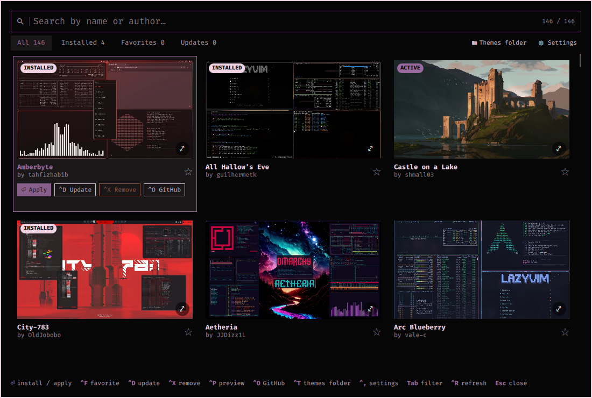
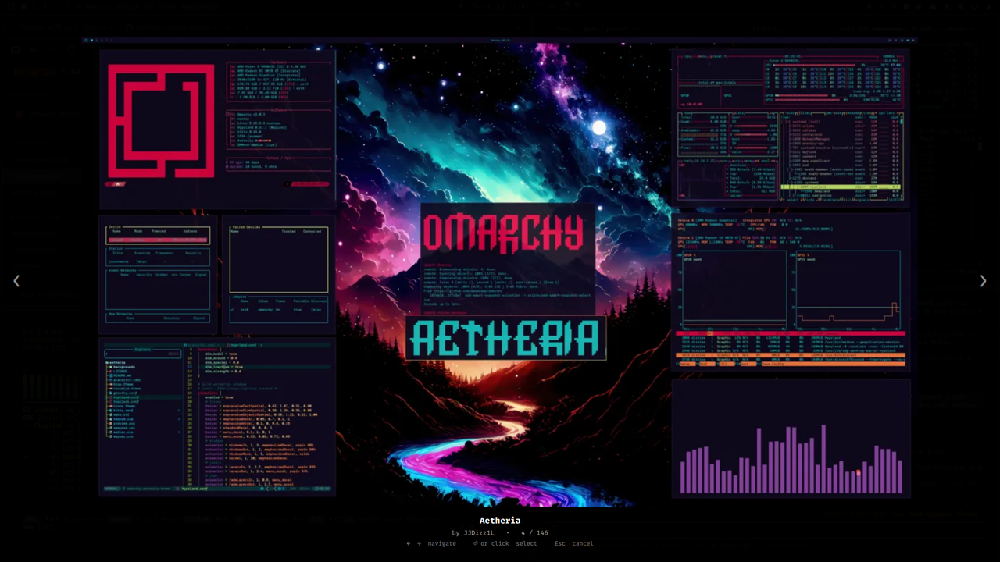
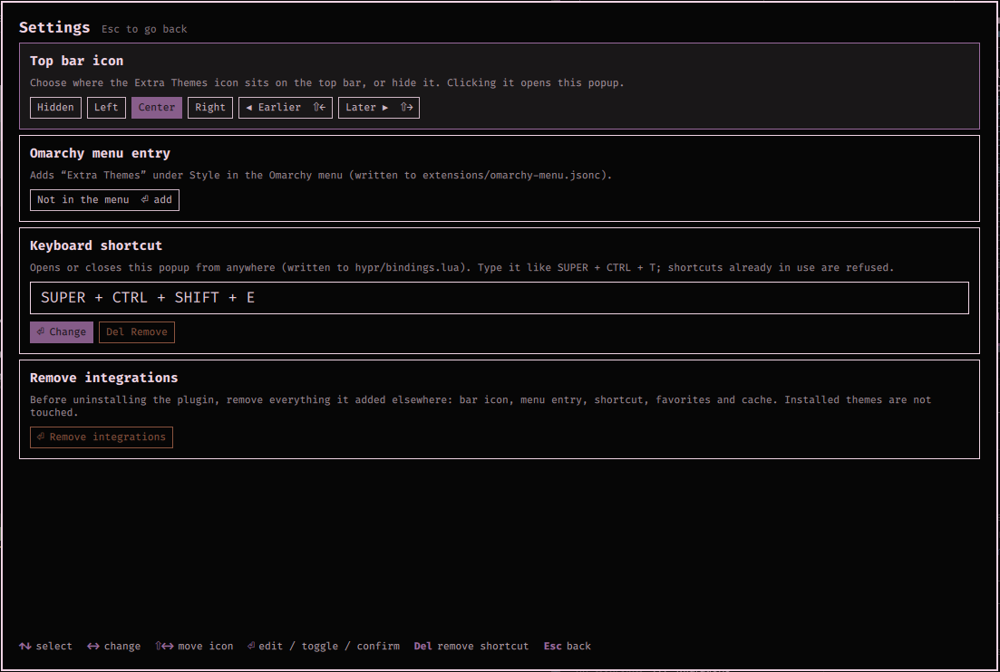

# Extra Themes for Omarchy

A popup to browse, search, install, uninstall, favorite and update the
[Omarchy extra themes](https://omarchy.org/themes/), with a fullscreen preview,
an optional top-bar icon, an optional Omarchy menu entry and an optional
keyboard shortcut.



## Install

```bash
omarchy plugin add https://github.com/simakwm/omarchy-extra-themes.git
omarchy plugin enable io.github.simakwm.extra-themes
```

Plugins are added disabled so you can read the code first. Then open it:

```bash
omarchy-shell shell toggle io.github.simakwm.extra-themes
```

You can also place the icon on the bar, add a menu entry or register a
shortcut from the popup itself: **⚙ Settings**, or `Ctrl+,`.

**No icon on the bar?** `omarchy plugin enable` only places the icon when the
plugin is not yet in your `shell.json`, so after a reinstall it may be enabled
but not on the bar. Open the popup with the command above, go to **Settings →
Top bar icon** and pick Left, Center or Right.

## Features

**Browse and search**
- The full list of extra themes from omarchy.org (146 at the time of writing)
  as a grid of preview cards, 2 to 4 columns depending on the popup width.
- Search as you type, matching theme name, folder name and author. The counter
  next to the search box shows matches out of the total.
- Four filters with live counts: **All**, **Installed**, **Favorites**,
  **Updates**.
- Favorites are listed first, then installed themes, then the rest.
- Badges on each card: **ACTIVE** (the theme in use), **INSTALLED**, **UPDATE**
  (the theme has new commits upstream).
- The theme list is cached for 24 hours and falls back to the cache when you
  are offline. If it cannot be loaded at all you get an error screen that says
  how to retry.

**Install and manage**
- **Install and apply** in one step, from any theme card.
- **Apply** an installed theme, and **update** it with a fast-forward
  `git pull`. Updating the active theme re-applies it.
- **Uninstall** with a confirmation step. Only themes installed from git can be
  removed, so a theme you wrote by hand with the same name is never deleted.
  Uninstalling the active theme switches back to Tokyo Night, Omarchy's default.
- **Favorites** that persist between sessions.
- A spinner on the card while it works, and a status line with the result or the
  error. Success messages fade after a few seconds, errors stay longer.
- Update checks run in the background when the popup opens.

**Preview**
- A ⤢ icon on every card opens a **fullscreen preview** of that theme. Browse
  the previews of the neighbouring themes with the arrow keys, and go back to the
  popup with the theme you were looking at selected.



**Around the popup**
- **Open on GitHub**: opens the theme's page and closes the popup so the page is
  not hidden behind it.
- **Open the themes folder** (`~/.config/omarchy/themes`) in your file manager,
  also closing the popup.
- **Top bar icon**: a swatch of the active theme's colors, placed where you
  choose and moved with the keyboard or the mouse.
- **Omarchy menu entry** under *Style*.
- **Keyboard shortcut** that opens and closes the popup.
- **Remove integrations**, to undo all of the above before uninstalling.

## Keyboard shortcuts

### Browsing

| Key | Action |
|---|---|
| type anything | search |
| `Backspace` | delete a character |
| `Ctrl+Backspace` | delete a word |
| `Ctrl+U` | clear the search |
| `Esc` | clear the search; if it is empty, close the popup |
| `Tab` / `Shift+Tab` | next / previous filter (All, Installed, Favorites, Updates) |
| `←` `→` `↑` `↓` | move the selection |
| `PgUp` / `PgDn` | move one page |
| `Home` / `End` | first / last theme |
| `Enter` | install and apply, or apply if it is already installed |
| `Ctrl+P` | fullscreen preview |
| `Ctrl+F` | toggle favorite |
| `Ctrl+D` | update the theme |
| `Ctrl+X` | uninstall; press it again to confirm, any other key cancels |
| `Ctrl+O` | open the theme on GitHub |
| `Ctrl+T` | open the themes folder |
| `Ctrl+R` | reload the theme list and re-check for updates |
| `Ctrl+,` | open Settings |

### Fullscreen preview

| Key | Action |
|---|---|
| `←` `→` (or `↑` `↓`) | previous / next theme |
| `Home` / `End` | first / last theme |
| `Enter` | back to the popup, with this theme selected |
| `Esc` | back to the popup, keeping the selection you had before |

### Settings

| Key | Action |
|---|---|
| `↑` `↓` (or `Tab` / `Shift+Tab`) | move between the four options |
| `←` `→` | top bar icon: cycle Hidden, Left, Center, Right |
| `Shift+←` `Shift+→` | top bar icon: move it earlier / later in its section |
| `Enter` | menu entry: add or remove. Shortcut: start editing. Remove integrations: ask to confirm, then confirm |
| `Space` | menu entry: add or remove |
| `Del` / `Backspace` | shortcut: remove it |
| `Esc` or `Ctrl+,` | back to the theme list |

While editing the shortcut: type the combination, `Backspace` deletes a
character, `Ctrl+Backspace` a word, `Enter` saves and `Esc` cancels.

### Mouse

Everything also works with the mouse. Hovering a card selects it, a click
selects it and a double click installs or applies it. The selected card shows
its action buttons, the ☆ toggles the favorite, the ⤢ opens the preview, the
tabs switch filters, and in the preview you can click the side arrows to browse
or anywhere else to go back.

## Settings



- **Top bar icon**: hidden, left, center or right, and its position inside the
  section. Clicking the icon opens the popup. The icon is drawn from the active
  theme's colors, so it changes with the theme.
- **Omarchy menu entry**: adds *Extra Themes* under *Style* in the Omarchy menu.
- **Keyboard shortcut**: type a combination such as `SUPER + CTRL + T`.
  Combinations already used by another binding are refused, and the one in use
  is named. The popup suggests a free combination, requires at least one of
  `SUPER`, `CTRL` or `ALT`, and rolls `bindings.lua` back if Hyprland reports an
  error after reloading.
- **Remove integrations**: removes the bar icon, menu entry, shortcut, favorites
  and cache. Run it before uninstalling the plugin.

## What it touches

Nothing outside the plugin's own folder is changed unless you ask for it.

| Where | When |
|---|---|
| `~/.config/omarchy/themes/` | installing, updating or removing a theme |
| `~/.config/omarchy/shell.json` | placing or hiding the bar icon |
| `~/.config/omarchy/extensions/omarchy-menu.jsonc` | the menu entry (a marked block) |
| `~/.config/hypr/bindings.lua` | the shortcut (a marked block) |
| `~/.cache/omarchy-extra-themes/` | cached theme list |
| `~/.local/state/omarchy-extra-themes/` | your favorites |

Network access: `omarchy.org` (theme list and previews) and the GitHub
repositories of the themes you install or update.

Themes are installed with `omarchy theme install`, so Omarchy's own rules about
what a cloned theme may contain apply. Like every Omarchy plugin, this one runs
unsandboxed inside `omarchy-shell`.

## Uninstall

Open Settings, choose **Remove integrations** and confirm, then:

```bash
omarchy plugin remove io.github.simakwm.extra-themes
```

Themes you installed are left in place.

## Requirements

Omarchy with the plugin system, `python3` (standard library only), `git`,
`xdg-open` and `hyprctl`.

## Development

```bash
./install.sh          # sync this checkout into ~/.config/omarchy/plugins/
omarchy restart shell # needed for QML changes, the popup stays loaded
```

The plugin is installed as a real directory, not a symlink: the shell refuses
bar widgets that load through one.

## License

MIT
